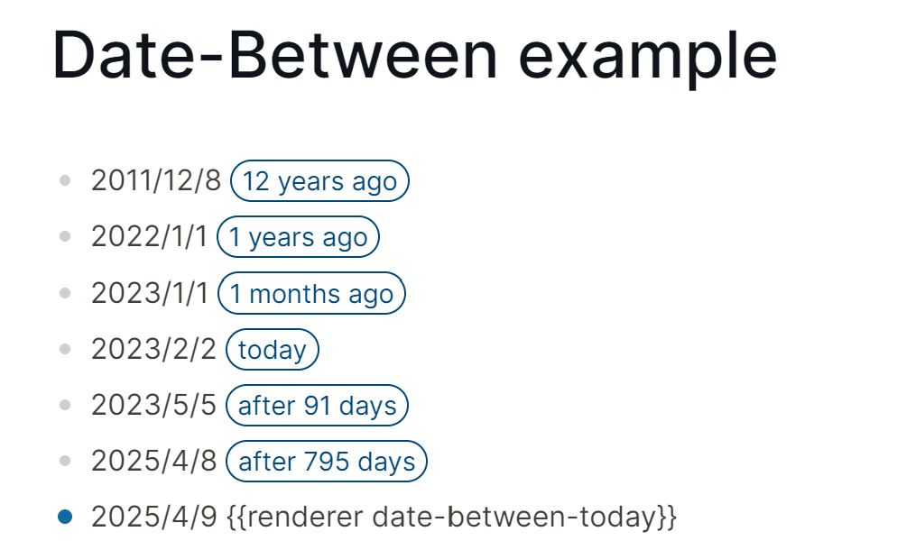

# logseq-date-between

**Logseq has a ton of unfixed bugs and isn't ready for production use at all.  Archiving this project because I've switched to another note-taking application.**

Just make a timeline.

## Usage

Insert `{{renderer date-between-today}}` nearby your date.

*You can use slash command `DateBetween: Date between today` to insert the same thing.*
